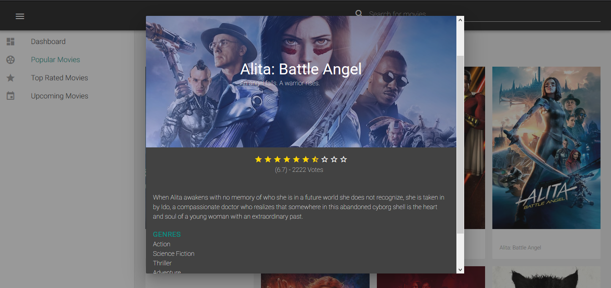

# Vuems
Catálogo de filmes com dados da API [The Movie Database](https://www.themoviedb.org/)
## Project setup
```
npm install
```

### Compiles and hot-reloads for development
```
npm run serve
```
###

Coloque sua chave no arquivo theMovieDb.js para ter acesso a [API](https://www.themoviedb.org/).
    src/theMovieDb.js

